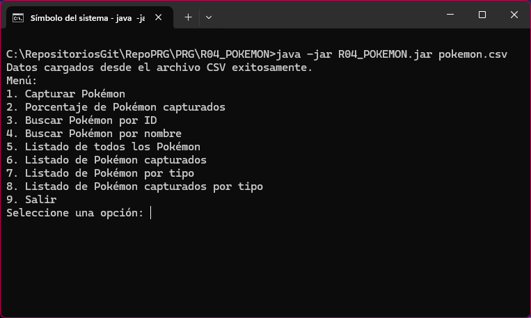

***
#### ⚠️ The recommendation is to open this README file in a Markdown editor or in IntelliJ IDEA, as Visual Studio Code sometimes encounters issues with certain links and other components of the file in its preview mode. ⚠️
***

# PROJECT: Pokémon Database <a name="top"></a>

<p align.text="left">
  

 </p>  

- `Finality`: The program allows extracting information from a CSV file. Pokemon database.
- `pokemon.csv`: This example CSV file is located in the directory R04_POKEDEX.
- `run_pokedex.bat`: This is a script for run program in your terminal with one click. Is located in the same folder as R04_POKEDEX.jar

## Sections of this README

***
  - [Prerequisites 📋 ](#prerequisites--a-nameprea)
  - [Run files 🔧 ](#run-files--a-nameruna)
  - [Tools 🛠️ ](#tools--a-nametoolsa)
  - [Libraries 📚 ](#libraries--a-namelibrariesa)
  - [General Info 📝 ](#general-info--a-nameinfoa)
  - [Usage clarification 📖 ](#usage-clarification--a-nameextraa)
  - [Auth@r ✒️ ](#authr--a-nameautora)
  - [License 📄](#license-a-namelicensea)

## Prerequisites 📋 <a name="pre"></a>
***

_Things you need to run the project_

```
Java Development Kit (JDK) installed on your machine
IDE (Integrated Development Environment) like IntelliJ IDEA or VScode
```

## Run files 🔧 <a name="run"></a>

***
_For now, this program doesn't have a GUI or graphical interface. You will need to use the console or an appropriate IDE for the Java language._


To execute the program, click on:
```
run_pokedex.bat
```
This script will automatically open the console and then execute the following command:
```bash
java -jar R04_POKEDEX.jar pokemon.csv
```
_If the file is opened in an IDE like IntelliJ, it can be directly executed by clicking on this command._


## Tools 🛠️ <a name="tools"></a>

***
_Click to follow the links to the tools._

[](https://www.microsoft.com/es-es/software-download/windows11)

[](https://www.java.com/es/download/ie_manual.js/)

[](https://www.jetbrains.com/es-es/idea/)

[](https://www.markdownguide.org/tools/)

## Libraries 📚 <a name="libraries"></a>
***

A list of libraries used within the project:

- [Java SE 22 & JDK 22](https://docs.oracle.com/en/java/javase/22/docs/api/index.html): Version 22.0.0
  
## General Info 📝 <a name="info"></a>
***
### Statement of minimum requirements for this project

_The content of the exercise and the program are in Spanish._

    Escribe las clases Pokedex y Pokemon con las que llevaremos una base de datos de los Pokémon que hemos capturado:

    Clase Pokemon

       Atributos:
       - id (int), 
         nombre (string)
         tipo (string)
         ataque (int)
         defensa (int)
         vida (int)
         ataqueespecial (int)
         defensaespecial (int)
         velocidad (int)
         habilidad (string)
         capturado (boolean)
         int puntero:  donde guardaremos un puntero que nos dirá por dónde vamos buscando en el texto.
       
       Constructores:
       - Un constructor al que le pasas los valores para todos los atributos y te crea el Pokémon.

       Métodos:
       - El método toString() que nos devolverá una ficha del Pokémon en la que aparezcan todos los datos.
       
       Propiedades:
       - Una propiedad de sólo lectura para cada atributo excepto para capturado, que será de lectura y escritura.
      
    Clase Pokedex

       Atributos:
       - Una lista de objetos de la clase Pokemon.
       
       Constructores:
       - Uno vacío que nos inicializa la lista nada más y otro al que le pasamos el nombre de un fichero CSV y nos carga la lista de Pokémon.

       Métodos:
       - leeCSV: le pasamos el nombre de un fichero y nos carga la lista desde un fichero CSV (el fichero os lo paso yo).
       - guardaCSV: le pasamos un nombre de fichero y nos guarda en ese fichero la lista de Pokémon. Será igual que el fichero original, pero cambiará el último campo donde nos dice si el Pokémon ha sido capturado o no. 
       - capturaPokemon: le pasamos el nombre del Pokémon y lo marcará en la lista como capturado.
       - porcentajeCapturas: nos devolverá un double con el porcentaje de Pokémon de la lista que hemos capturado.
       - buscaPokemon(int id): nos devuelve un objeto de tipo Pokemon correspondiente a la id que le pasamos.
       - buscaPokemon(string nombre) lo mismo pero pasándole el nombre.
       - listadoPokemon: nos devuelve un listado de todos los Pokémon de la lista, mostrando los siguientes datos: id, nombre, tipo y si está capturado o no. El listado lo devolverá en un String, 
         que ya en el main se escribirá por pantalla.
       -  listadoPokemonCapturados: nos devuelve un listado de los Pokémon que hayamos capturado, mostrando: id, nombre y tipo.
       - listadoPokemonTipo(string tipo): nos muestra un listado de todos los Pokémon de ese tipo, incluyendo: id, nombre y si está capturado.
       - listadoPokemonCapturadosTipo(string tipo): nos muestra un listado de los Pokémon que hayamos capturado pero solamente los que sean de ese tipo, incluyendo: id y nombre.

       Main:
       - En el programa principal, tendremos un menú con varias opciones, para cada uno de los métodos (menos leeCSV y guardaCSV que lo debe hacer automáticamente al iniciar y finalizar el programa, respectivamente).

### Operation of the program

1. **Loading Pokémon Data**:
   1. At the start of the program, Pokémon data is loaded from a CSV file specified as a command-line argument.
   2. The Pokémon data includes attributes such as ID, name, type, stats, abilities, and capture status.
   

2. Menu Navigation:
   1. The program presents a menu with various options for interacting with the Pokémon database.
   2. Users can select options such as capturing Pokémon, querying Pokémon information, and calculating the percentage of captured Pokémon.
   

3. Capturing Pokémon:
   1. Users can capture a Pokémon by entering its name. 
   2. If the Pokémon is successfully captured, its capture status is updated, and the information is saved to the CSV file. 
   

4. Querying Pokémon Information:
   1. Users can search for Pokémon by their ID or name.
   2. They can also list all Pokémon in the database, display only captured Pokémon, or list Pokémon by type.
   

5. Calculating Percentage of Captured Pokémon:
   1. The program calculates the percentage of Pokémon captured in the current database. 
   

6. Exiting the Program:
   1. Users can exit the program, which triggers the updated Pokémon list to be saved to the CSV file.

### How the Program Works

* The program utilizes the Pokemon class to represent individual Pokémon, with attributes and methods for manipulation.
* The Pokedex class manages the list of Pokémon, including loading and saving data, capturing Pokémon, and querying information. 
* The main logic of the program is implemented in the Main class, which presents the menu, handles user input, and interacts with the Pokedex class.


## Usage clarification 📖 <a name="extra"></a>
***
_Clarifications about the project_

### Description

This Java program implements a simple application to manage a database of Pokémon.

### Features

* Load and save Pokémon data from/to a CSV file.
* Capture Pokémon by name. 
* Query Pokémon information by ID or name. 
* List all Pokémon, captured Pokémon, or Pokémon by type. 
* Calculate the percentage of captured Pokémon.
* PokedexSave.csv is a backup file. 

### Usage

To use the program, follow these steps:

1. **Compile the Source Code**:
   - Compile the Java source code using a Java development environment or through the command line.

2. **Execute the Program**:
   - Run the program using the generated JAR file.
   - Provide the name of the CSV file containing Pokémon data as a command-line argument.

   ```bash
   java -jar R04_POKEDEX.jar pokemon.csv
   
_If the file is opened in an IDE like IntelliJ, it can be directly executed by clicking on this file._

_And you can execute the program directly by clicking on [run_pokedex.bat](run_pokedex.bat)_


### Screenshot

_Program preview_

 

## Auth@r ✒️ <a name="autor"></a>

***
**María Diaz-Rozas** &nbsp; [](https://github.com/mdrp93) &nbsp;
← _Click to view GitHub profile_

## License 📄<a name="license"></a>

***
This project is under the MIT License - see the [LICENSE.md](LICENSE.md) file for details.

<br>

[Subir](#project-pokémon-database-a-nametopa)
