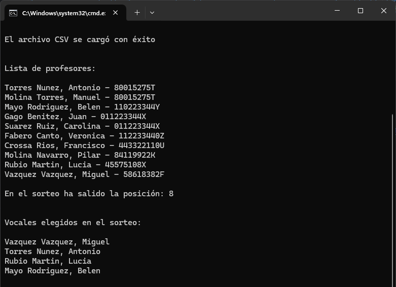

***

#### ⚠️ The recommendation is to open this README file in a Markdown editor or in IntelliJ IDEA, as Visual Studio Code sometimes encounters issues with certain links and other components of the file in its preview mode. ⚠️

***

# PROJECT: Tribunal de Porfesores <a name="top"></a>

<p>
  

 </p>  

- `Finality`: The program allows extracting information from a CSV file. Pokemon database.
- `profesores.csv`: This example CSV file is located in the directory R05_TRIBUNAL.
- `run_tribunal.bat`: This is a script for run program in your terminal with one click. Is located in the same folder asIt must be located in the same folder as R05_TRIBUNAL.jar
- `convertidorBinario.jar`: [This JAR](convertidorBinario.jar) file provides functionality to convert data files between binary and CSV formats.

## Sections of this README

***

  - [Prerequisites 📋 ](#prerequisites--a-nameprea)
  - [Run files 🔧 ](#run-files--a-nameruna)
  - [Tools 🛠️ ](#tools--a-nametoolsa)
  - [Libraries 📚 ](#license-a-namelicensea)
  - [General Info 📝 ](#general-info--a-nameinfoa)
  - [Usage clarification 📖 ](#usage-clarification--a-nameextraa)
  - [Auth@r ✒️ ](#authr--a-nameautora)
  - [License 📄](#license-a-namelicensea)

## Prerequisites 📋 <a name="pre"></a>

***

_Things you need to run the program and view the code project_

```
Java Development Kit (JDK) installed on your machine
IDE (Integrated Development Environment) like IntelliJ IDEA or VScode

cmd, shell or bash in your OS - for running the program only
```

## Run files 🔧 <a name="run"></a>

***
_For now, this program doesn't have a GUI or graphical interface. You will need to use the console or an appropriate IDE for the Java language._

To execute the program, click on:

```
run_tribunal.bat
```

This script will automatically open the console and then execute the following command:

```bash
java -jar R05_TRIBUNAL.jar profesores.csv
```

_If the file is opened in an IDE like IntelliJ, it can be directly executed by clicking on this command._

## Tools 🛠️ <a name="tools"></a>

***
_Click to follow the links to the tools._

[](https://www.microsoft.com/es-es/software-download/windows11)

[](https://www.java.com/es/download/ie_manual.js/)

[](https://www.jetbrains.com/es-es/idea/)

[](https://www.markdownguide.org/tools/)

## Libraries 📚 <a name="libraries"></a>

***

A list of libraries used within the project:

- [Java SE 22 & JDK 22](https://docs.oracle.com/en/java/javase/22/docs/api/index.html): Version 22.0.0
  
## General Info 📝 <a name="info"></a>

***

### Statement of minimum requirements for this project

_The content of the exercise and the program are in Spanish._

    Escribe las clases Profesor y Tribunal. La clase Tribunal tendrá una lista de profesores y nos permitirá sortear a los que les toca ser tribunal de oposiciones. 
    Tendremos que escribir los siguientes elementos:

    Enum TipoGenero: 
         tendrá dos valores: “Hombre” y “Mujer”.

    Clase Profesor

       Atributos:
       - nombre: será el nombre del profesor. Será una cadena y no podrá estar vacía. (String)
       - dni: será el DNI del profesor. Será una cadena de 9 caracteres. (String)
       - genero: podrá ser hombre o mujer. (TipoGenero)
       
       Constructores:
       - Un constructor al que le pasamos el nombre, el dni y el genero, comprueba que está bien y los almacena en los atributos.

       Métodos:
       - ToString(): nos devuelve una cadena con el nombre y el DNI del profesor.
       
       Propiedades:
       - Una para cada atributo, de lectura y escritura, que comprueba que los datos están bien antes de modificarlos.
      
    Clase Tribunal

       Atributos:
       - listaProfesores: será una lista de Profesor.
       
       Constructores:
       - Un constructor al que le pasamos un nombre de un fichero y nos carga los datos de los profesores desde el fichero a nuestra lista. El fichero será un fichero binario (os doy dos de muestra), en el que van los datos de 
         los profesores de forma secuencial: un string con el nombre, un string con el dni y un entero con el genero (0=hombre, 1=mujer), y a continuación el siguiente profesor.

       Métodos:
       - EligeTribunal(): nos hace el sorteo del tribunal de entre los profesores que hay en la lista. El procedimiento es el siguiente: se muestra la lista de los profesores por pantalla. Sorteamos una posición de la lista al azar.
         Y a partir de esa posición, elegiremos dos hombres y dos mujeres.
         
         Rubio Martín, Lucía - 45575108X
         ...
         Torres Núñez, Antonio - 80015275T
         Molina Navarro, Pilar - 84119922K
         Vázquez Vázquez, Miguel - 58618382F
         En el sorteo ha salido la posición: 17
         Vocales elegidos en el sorteo:
         Torres Núñez, Antonio
         Molina Navarro, Pilar
         Vázquez Vázquez, Miguel
         Rubio Martín, Lucía
         
       - Opcionalmente, hacer el sorteo de verdad en la función EligeTribunalPro(), que hace lo mismo pero ordenando la lista antes por el DNI pero leído de derecha a izquierda (sin la letra).

### Operation of the program

1. **Loading Professors' Data**:
   1. The program can load professors' data from either a binary or CSV file specified as a command-line argument.
   2. Data comprises professor names, DNIs, and genders, ensuring flexibility in data format.
   3. The program expects the input file to be formatted with professor data separated by dashes ("-").

2. Selecting Tribunal Members:
   1. Upon user request, the program conducts the tribunal selection process.
   2. It randomly selects two male and two female professors from the loaded data to form the tribunal.

3. Optional: File Format Conversion:
   1. Users can utilize the included "R05_TRIBUNAL\ConvertidorArchivoBinario.jar") program to convert between CSV and binary formats.
   2. This standalone tool offers flexibility in handling different data file formats.

```bash
java -jar convertidorBinario.jar
````

### How the Program Works

- The program ensures versatility by accepting input data in both CSV and binary formats.
- A separate conversion tool, "convertidorBinario," enables users to convert files between formats, enhancing usability and data management capabilities.
- Main logic is encapsulated within the Main class, orchestrating menu interactions, tribunal selection, and interaction with auxiliary programs like the file converter.

## Usage clarification 📖 <a name="extra"></a>

***
_Clarifications about the project_

### Description

This Java program manages a tribunal system for academic evaluations. The Tribunal class maintains a list of professors and facilitates the random selection of tribunal members for examinations.

### Features

- Tribunal class maintains a list of professors.
- Facilitates random selection of tribunal members for examinations.

### Usage

To use the program, follow these steps:

1. **Compile the Source Code**:
   - Compile the Java source code using a Java development environment or through the command line.

2. **Execute the Program**:
   - Run the program using the generated JAR file.

```bash
 java -jar R04_POKEMON.jar pokemon.csv
````
_If the file is opened in an IDE like IntelliJ, it can be directly executed by clicking on this file._

### And you can execute the program directly by clicking on [run_tribunal.bat](run_tribunal.bat)

- This is a combined Windows batch script (_.bat) and Linux shell script (_.sh).
- The part within `if "%OS%"=="Windows_NT"` will execute on Windows systems, while the part in `else` will execute on Linux systems.
- On [](https://www.microsoft.com/es-es/software-download/windows11), this script will open a new Command Prompt window (`cmd`) and execute the command `java -jar R05_TRIBUNAL.jar %1`.
- On [](https://www.linux.org/pages/download/), it will open the default terminal (`x-terminal-emulator`) and execute the command `java -jar R05_TRIBUNAL.jar $1`.

### Screenshot

_Program preview_



## Auth@r ✒️ <a name="autor"></a>

***
**María Diaz-Rozas** &nbsp; [](https://github.com/mdrp93) &nbsp;
← _Click to view GitHub profile_

## License 📄<a name="license"></a>

***
This project is under the MIT License - see the [LICENSE.md](LICENSE.md) file for details.

<br>

[Subir](#project-tribunal-de-porfesores-a-nametopa)
