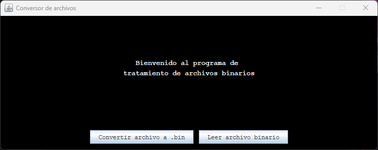
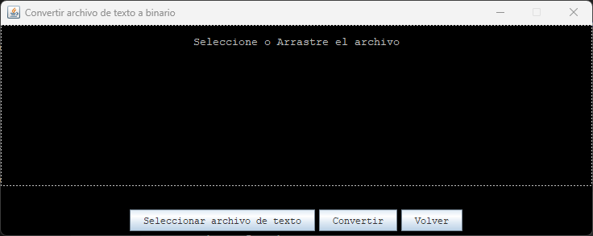
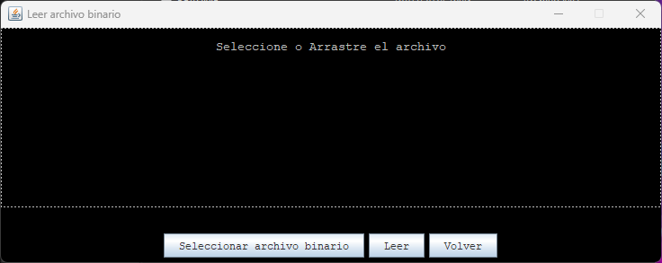

***
#### ⚠️ The recommendation is to open this README file in a Markdown editor or in IntelliJ IDEA, as Visual Studio Code sometimes encounters issues with certain links and other components of the file in its preview mode. ⚠️
***

# PROJECT: Text to Binary Converter <a name="top"></a>

<p>
  

 </p>  

- `Finality`: Text to Binary File Converter.
- `profesor.csv`: This example CSV file is located in the directory _convertidorBinario_.
- `convertidorBinario.jar`: Click on this .jar file, and run the program.

## Sections of this README

***
  - [Prerequisites 📋 ](#prerequisites--a-nameprea)
  - [Run files 🔧 ](#run-files--a-nameruna)
  - [Tools 🛠️ ](#tools--a-nametoolsa)
  - [Libraries 📚 ](#libraries--a-namelibrariesa)
  - [General Info 📝 ](#general-info--a-nameinfoa)
  - [Usage clarification 📖 ](#usage-clarification--a-nameextraa)
  - [Auth@r ✒️ ](#authr--a-nameautora)
  - [License 📄](#license-a-namelicensea)

## Prerequisites 📋 <a name="pre"></a>
***

_Things you need to run the project_

```
Java Development Kit (JDK) installed on your machine
IDE (Integrated Development Environment) like IntelliJ IDEA or VScode
```

## Run files 🔧 <a name="run"></a>

***
_Step-by-step guide on how to run the program_

This program have a simple GUI graphical interface. 

But if you can to run the program in the console by executing the following command: 

```shell
java -jar convertidorBinario.jar
````

_If the file is opened in an IDE like IntelliJ, it can be directly executed by clicking on this command._


## Tools 🛠️ <a name="tools"></a>

***
_Click to follow the links to the tools._

[](https://www.microsoft.com/es-es/software-download/windows11)

[](https://www.java.com/es/download/ie_manual.js/)

[](https://www.jetbrains.com/es-es/idea/)

[](https://www.markdownguide.org/tools/)

## Libraries 📚 <a name="libraries"></a>
***

A list of libraries used within the project:

- [Java SE 22 & JDK 22](https://docs.oracle.com/en/java/javase/22/docs/api/index.html): Version 22.0.0
  
## General Info 📝 <a name="info"></a>

#### Class: ConvertirArchivoGUI

- **Main Class**: `ConvertirArchivoGUI`
- **Key Methods**:
   1. `convertirArchivo(String nombreArchivoBinario)`: Converts a text file to a binary file.
   2. `seleccionarArchivo()`: Opens a file chooser for the user to select a text file.
   3. `leerArchivo()`: Reads a binary file selected by the user.
   4. `FileDropHandler`: Inner class that handles file drag and drop.
- **Important Properties**:
   - `archivoTextoSeleccionado`: Stores the text file selected by the user.
   - `archivoBinarioGenerado`: Stores the generated binary file after conversion.
   - `dropPanel`: Panel that allows file drag and drop.
   - `dragDropLabel`: Label that displays messages related to file drag and drop.

#### Class: LeerArchivoBinarioGUI

- **Key Methods**:
   1. `leerArchivoBinario(File archivoBinario)`: Reads a binary file and displays its content in a text editor.
   2. `abrirEditorTexto(String texto)`: Opens a text editor with the provided content.
   3. `seleccionarArchivo()`: Opens a file chooser for the user to select a binary file.
   4. `FileDropHandler`: Inner class that handles file drag and drop.
- **Important Properties**:
   - `archivoArrastrado`: Stores the binary file dragged and dropped by the user.
   - `dropPanel`: Panel that allows file drag and drop.
   - `dragDropLabel`: Label that displays messages related to file drag and drop.
  
#### Class: MainGUI
- **Main Class**: `MainGUI`
- **Key Methods**:
   1. `main(String[] args)`: Main entry method that starts the application.
- **Important Properties**:
   - `btnConvertir`: Button to open the file conversion interface.
   - `btnLeer`: Button to open the file reading interface.
  
### Operation of the program


1. **Selecting Text File**:
   1. Users can choose a text file to convert to binary format by either selecting it through a file chooser dialog or dragging and dropping it onto the designated panel.
   2. The program provides visual feedback upon file selection, displaying the path of the selected file.

2. **Converting to Binary**:
   1. After selecting a text file, users are prompted to enter a name for the output binary file.
   2. Upon conversion, the program writes the contents of the text file to the binary file, following a specified format.
   3. Each line in the text file is split into components using the '-' delimiter, and these components are written to the binary file accordingly.

3. **Displaying Binary File**:
   1. Upon successful conversion, users can choose to view the directory containing the generated binary file.
   2. Clicking the "Mostrar archivo .bin en directorio" button opens the directory containing the binary file using the system's default file explorer.

4. **File Drag-and-Drop Support**:
   1. The program supports file drag-and-drop functionality, allowing users to drop text files onto the designated panel for quick selection.
   2. Files dropped onto the panel are automatically detected and processed for conversion.

5. **Error Handling**:
   1. The program includes error handling mechanisms to handle various scenarios, such as invalid file formats or file operations errors.
   2. Users are notified of any encountered errors through informative dialog boxes, ensuring a smooth user experience.

6. **Returning to Main Menu**:
   1. Users have the option to return to the main menu to access other functionalities or exit the program.
   2. The "Volver" button allows users to navigate back to the main menu, facilitating seamless program navigation.

### How the Program Works

* Select File: Users can choose a text file either by browsing their system or by dragging and dropping it onto the program's interface.
* Convert: Once a text file is selected, users are prompted to provide a name for the output binary file. The program then converts the text file into binary format.
* View Binary File: After conversion, users have the option to view the directory containing the generated binary file.
* Error Handling: The program handles various error scenarios gracefully, informing users if any issues arise during the conversion process.
* Return to Main Menu: Users can easily navigate back to the main menu to access other features or exit the program.

## Usage clarification 📖 <a name="extra"></a>
***
_Clarifications about the project_

### Description

The Text File Converter program serves as a versatile tool for converting text files into binary format and includes a feature to read binary files. 
It provides users with a convenient interface to manage file conversion tasks efficiently.

### Features

* **Text to Binary Conversion:** Converts text files to binary format, expanding beyond CSV files.
* **File Selection Options:** Allows users to either select files from a directory or drag and drop them onto the program window for loading.
* **Custom Output File Creation:** Enables users to specify the name and destination folder for the newly converted binary file. If no destination is specified, it defaults to the directory of the input file.
* **Directory Navigation:** Provides functionality to display the location of the generated .bin file after conversion, facilitating easy access for users.
* **User-Friendly Interface:** Presents a straightforward and intuitive interface for seamless interaction, enhancing user experience.

### Usage

* **File Loading Options:** Users can load files either by selecting them from a directory or by dragging and dropping them onto the program window.
* **Custom Output File Creation:** Upon conversion to binary format, users can choose the destination folder and specify the name for the new binary file. If no destination is provided, the file is saved in the directory of the original text file.
* **Display Converted File Location:** After the conversion process, the program displays the folder location of the newly created .bin file for user convenience.
* **Text Editor:** When the program reads a binary file, it will open the default text editor installed on the system or chosen by the user.


_If the file is opened in an IDE like IntelliJ, it can be directly executed by clicking on this file._


### Screenshot

_Program preview_







## Auth@r ✒️ <a name="autor"></a>

***
**María Diaz-Rozas** &nbsp; [](https://github.com/mdrp93) &nbsp;
← _Click to view GitHub profile_

## License 📄<a name="license"></a>

***
This project is under the MIT License - see the [LICENSE.md](LICENSE.md) file for details.

<br>

[Subir](#project-text-finder-buscatexto-a-nametopa)
